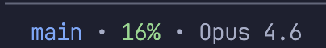

# Fun Stuff

Optional extras that make Claude Code more enjoyable to use. None of these are required – just nice to have.

---

## 1. Customize Your Status Line

The status line shows helpful info at a glance while you work.



**What it shows:**
- **Branch** — Current git branch (blue)
- **Context %** — How much of Claude's memory is used (green/yellow/red based on usage)
- **Model** — Which Claude model is active (e.g., Opus 4.5)
- **Active subagent** — Which subagent is running, if any (cyan)

### a. How to Set It Up

Give Claude Code this prompt:

````
Set up a custom status line for Claude Code.

1. Create ~/.claude/statusline.sh with this script and make it executable:

```bash
#!/bin/bash
input=$(cat)

BLUE='\033[94m'
GREEN='\033[92m'
YELLOW='\033[93m'
RED='\033[91m'
CYAN='\033[96m'
RESET='\033[0m'

branch=$(git branch --show-current 2>/dev/null || echo "no-git")
percent=$(echo "$input" | jq -r '.context_window.used_percentage // 0' | xargs printf "%.0f")
model=$(echo "$input" | jq -r '.model.display_name // .data.model.display_name // ""')

AGENT_TRACKER="/tmp/claude-subagent-$USER"
subagent=""
if [ -f "$AGENT_TRACKER" ]; then
  subagent=$(cat "$AGENT_TRACKER")
fi

if [ "$percent" -lt 45 ]; then
  PERCENT_COLOR=$GREEN
elif [ "$percent" -lt 70 ]; then
  PERCENT_COLOR=$YELLOW
else
  PERCENT_COLOR=$RED
fi

if [ -n "$model" ]; then
  if [ -n "$subagent" ]; then
    echo -e "${BLUE}${branch}${RESET} • ${PERCENT_COLOR}${percent}%${RESET} • ${model} ${CYAN}→ ${subagent}${RESET}"
  else
    echo -e "${BLUE}${branch}${RESET} • ${PERCENT_COLOR}${percent}%${RESET} • ${model}"
  fi
else
  echo -e "${BLUE}${branch}${RESET} • ${PERCENT_COLOR}${percent}%${RESET}"
fi
```

2. Create ~/.claude/hooks/ directory and add ~/.claude/hooks/track-subagent.sh with this script, make it executable:

```bash
#!/bin/bash
input=$(cat)
action="$1"
AGENT_TRACKER="/tmp/claude-subagent-$USER"

if [ "$action" = "start" ]; then
  echo "$input" | jq -r '.agent_type // "agent"' > "$AGENT_TRACKER"
elif [ "$action" = "stop" ]; then
  rm -f "$AGENT_TRACKER"
fi

exit 0
```

3. Add this to ~/.claude/settings.json (merge with existing settings if the file already exists):

```json
{
  "hooks": {
    "SubagentStart": [{ "matcher": "", "hooks": [{ "type": "command", "command": "~/.claude/hooks/track-subagent.sh start" }] }],
    "SubagentStop": [{ "matcher": "", "hooks": [{ "type": "command", "command": "~/.claude/hooks/track-subagent.sh stop" }] }]
  },
  "statusLine": {
    "type": "command",
    "command": "~/.claude/statusline.sh",
    "padding": 0
  }
}
```
````

Restart Claude Code to see the status line.

### b. Why It's Useful

- **Context %** tells you when to `/compact` (if it's getting high)
- **Model** confirms you're using the right Claude for the task
- **Branch** prevents accidental commits to the wrong branch

---

## 2. Preview Markdown in Your Browser

If you write markdown files (notes, documentation, READMEs), you can preview them as beautifully styled pages in your browser – like how they'd look in Notion.

**What it does:** Converts any `.md` file into a styled HTML page and opens it in your browser. No more squinting at raw markdown.

### a. Set Up in Global CLAUDE.md

Give Claude Code this prompt:

```
Set up a `mdview` shell function so I can preview .md files in my browser.

1. Install pandoc via homebrew if not already installed
2. Create ~/.pandoc/ directory
3. Download a clean Notion-style CSS to ~/.pandoc/notion.css (find one online or generate a minimal one)
4. Add these functions to my ~/.zshrc:

mdview() {
  pandoc "$1" --embed-resources --standalone --css="$HOME/.pandoc/notion.css" -o /tmp/mdview.html && open /tmp/mdview.html
}

mdrefresh() {
  pandoc "$1" --embed-resources --standalone --css="$HOME/.pandoc/notion.css" -o /tmp/mdview.html
}

5. Reload my shell config

Then test it by running: mdview README.md
```

Once that's working, add this to your project or global CLAUDE.md so Claude knows the shortcut:

```markdown
### Markdown Preview

When user says "open [file].md" or "pandoc [file]", run the `mdview` shell function to preview it in the browser:

source ~/.zshrc && mdview "<path-to-file>"

When user says "refresh", run `mdrefresh` to rebuild the HTML without opening a new tab:

source ~/.zshrc && mdrefresh
```

Then you can just tell Claude "open readme.md" and it'll render and open it in your browser.

### b. Combine with a Formatting Skill

If you don't want to add markdown rules to your CLAUDE.md (to keep it lean), you can use a skill instead. The [`skills/md/`](skills/md/) folder in this guide includes a ready-made `/md` skill that:

- **Formats markdown** with pandoc-compatible rules (blank lines before lists, en-dashes, table alignment, etc.)
- **Previews markdown** using the `mdview` and `mdrefresh` functions from above

This way, Claude only loads the formatting rules when you're actually working on markdown – not every session.

**How to install it:**

**Option A: Ask Claude to create it**

1. Open [`skills/md/SKILL.md`](skills/md/SKILL.md) in this guide
2. Copy the contents
3. Tell Claude:

```
Create a /md skill with these instructions:

[paste the contents here]
```

Claude will create the skill folder at `~/.claude/skills/md/SKILL.md` for you.

**Option B: Copy the file manually (if you're comfortable with terminal)**

```bash
mkdir -p ~/.claude/skills/md
cp skills/md/SKILL.md ~/.claude/skills/md/SKILL.md
```

Once installed, type `/md` to invoke it explicitly, or Claude will auto-apply the formatting rules whenever it creates or edits `.md` files.

### How to Use It

**Open a preview:**

```bash
mdview my-file.md
```

This converts the file to styled HTML and opens it in your browser.

**Update after edits:**

```bash
mdrefresh
```

Then press `Cmd + R` in your browser to see the changes. (`mdrefresh` rebuilds the HTML without opening a new tab.)

### Tip: Use a Markdown Editor

You can also use a third-party markdown editor to read and edit your `.md` files with a nicer interface than VS Code. [Zettlr](https://www.zettlr.com/) is a free, open-source option that renders markdown inline as you type – great for writing documentation, research notes, or guides.

---

## 3. Anonymize Research Data

If you work with user research (interview transcripts, survey responses, etc.), you need to strip out participant names and other personally identifiable information before giving files to Claude.

The `tools/` folder includes two versions of an anonymization script. Both use Microsoft Presidio to automatically detect and replace PII in `.md`, `.txt`, `.csv`, `.xlsx`, and `.json` files – names, emails, phone numbers, locations, and more. People get numbered labels (`<PERSON_1>`, `<PERSON_2>`) so you can still track who said what without exposing real names.

**Important:** You run these scripts in a separate terminal, outside of Claude Code. This keeps raw participant data out of Claude's context entirely.

### a. Which Version Should I Use?

| Version | Best for | Name detection | Download size |
| ------- | -------- | -------------- | ------------- |
| [**Anonymize Research**](tools/Anonymize%20Research/) (recommended) | Teams with diverse participant names | Multilingual – Malay, Chinese, Indian, Arabic, Western, etc. | ~1.2 GB |
| [**Anonymize Research – Western**](tools/Anonymize%20Research%20-%20Western/) | Teams with only Western/English participant names | English names only | ~500 MB |

The **recommended version** uses a multilingual transformer model and a **two-pass system** – if a name is detected on any line, a cleanup pass catches any remaining occurrences the model missed (including partial names and possessives like "Jane's").

The **Western version** is lighter and faster, but only reliably detects Western/English names.

### b. Setup and Usage

See each version's README for setup and usage instructions:

- [Anonymize Research README](tools/Anonymize%20Research/README.md) (recommended)
- [Anonymize Research – Western README](tools/Anonymize%20Research%20-%20Western/README.md)
